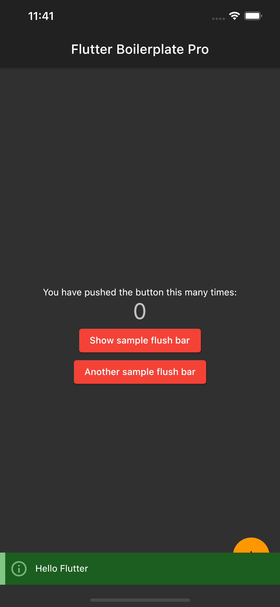
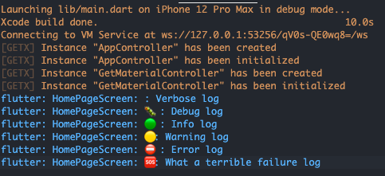

# flutter_boilerplate_pro

This flutter_boilerplate_pro will saved you ~30 minutes of doing configuration and writing boring code.

Just use it and have fun conding.


## Features:
- Package `flutter_launcher_icons` is used for creating fast app icon
    - The icon file is configured in `pubspec.yaml`
    - Command for update icon: `flutter pub run flutter_launcher_icons:main`
    - Reference: [https://pub.dev/packages/flutter_launcher_icons](https://pub.dev/packages/flutter_launcher_icons)
    - Free icon resource: [https://iconarchive.com/](https://iconarchive.com/)
- Package `flutter_native_splash` is used for creating splash screen
    - Command for update splash screen: `flutter pub run flutter_native_splash:create`
- Package `styled_widget` is used for widget code style
- Package `another_flushbar` is used for creating flushbar, similar to `toast`
- Package `get` is used for state management and routing
    - Pre-created `AppController`
- Package `cached_network_image`
- Package `logger` is used for logging
    - Add `custom_printer` class for customized emojis and log message
- Package `flutter_rename_app` is used for easy changing app name, app bundle
    - App's name and bundle information are configured in `pubspec.yaml`
    - Ref: [https://pub.dev/packages/flutter_rename_app](https://pub.dev/packages/flutter_rename_app)
    - Command for update app name and bundle: `flutter pub run flutter_rename_app`
- Prefer using app in portrait mode only
    ```dart
    SystemChrome.setPreferredOrientations(
      [DeviceOrientation.portraitUp, DeviceOrientation.portraitDown],
    ).then(
      (value) => runApp(MyApp()),
    );
    ```
- Turn off debugger banner
    ```dart
    debugShowCheckedModeBanner: false
    ```

## Sample screenshots





## Copyright
Copyright (c) 2021 Hoang Nam Hai (hai@mana.vn). See [LICENSE](LICENSE.txt)  for further details.
